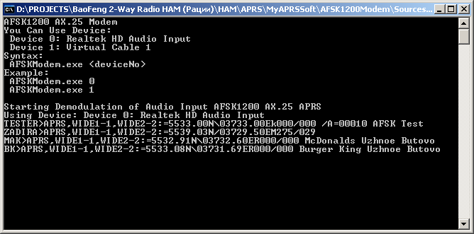

# AFSK1200Modem
AFSK 1200 X.25 APRS Modulator &amp; Demodulator

Detect AFSK 1200 X.25 APRS Packet from SoundCard and Console Out it
(see window.png) 

Usage
--------

You can use it as c# library for exchanging digital packet data between hamateur radios via air.     
Just use `AFSK1200Modulator` as DAC and `AFSK1200Demodulator` or `DirectAudioAFSKDemodulator` as ADC.    
Full samples available at [`AFSK1200ModemTest.cs`](AFSK1200ModemTest.cs).